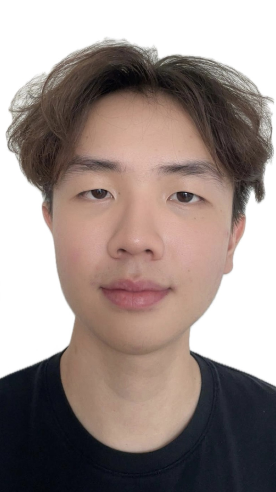
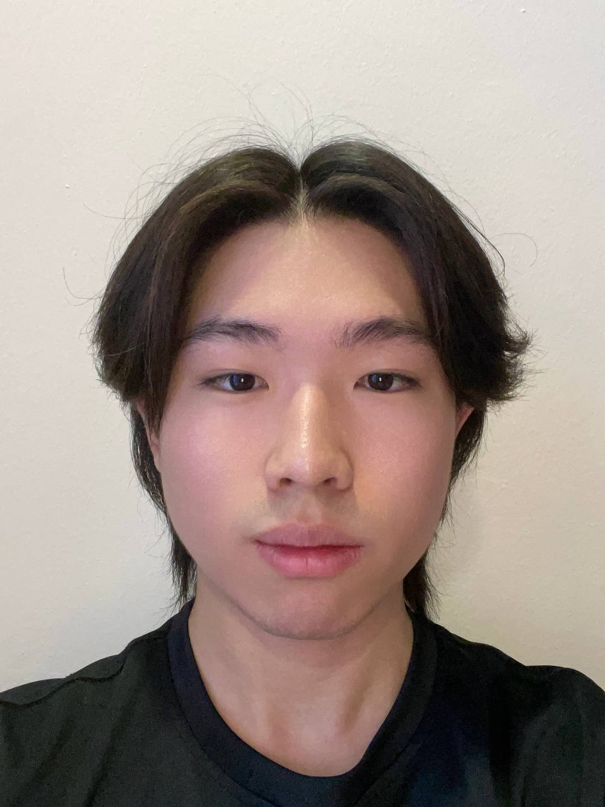
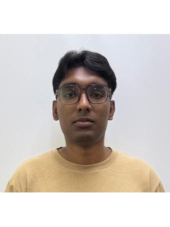
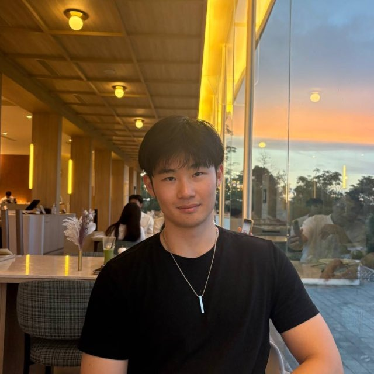
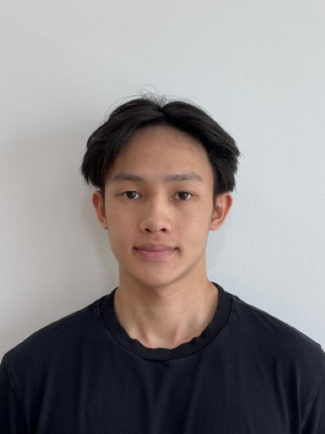

# About Us

We are a team based in the [School of Computing, National University of Singapore](http://www.comp.nus.edu.sg).

You can reach us at the email `seer[at]comp.nus.edu.sg`

## Project team

### Ian Sin

[[github](https://github.com/iansine)]

### Jonathan Koh

[[github](https://github.com/jonkohzy)]

* Role: Developer
* Responsibilities: Code quality
  * Looks after code quality, ensures adherence to coding standards, etc.

### John Doe

[[homepage](http://www.comp.nus.edu.sg/~damithch)]
[[github](https://github.com/johndoe)]
[[portfolio](team/johndoe.md)]

* Role: Project Advisor

### Jane Doe

[[github](https://github.com/dbs15329)]

* Role: Team Lead
* Responsibilities: UI

### Johnny Doe

[[github](http://github.com/johndoe)] [[portfolio](team/johndoe.md)]

* Role: Developer
* Responsibilities: Data

### Wesley Tay

[[github](https://github.com/WesleyTay25)]

* Role: Developer
* Responsibilities: Dev Ops + Threading

### Chester Lim Yi Jie

[[github](https://github.com/chesterlim2004)]

* Role: Developer
* Responsibilities: UI
