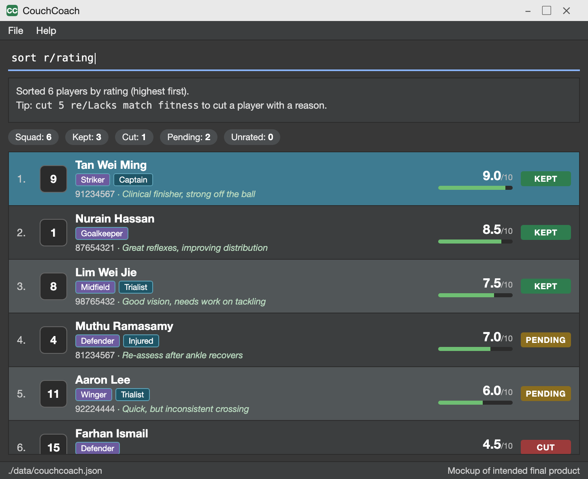

# CouchCoach

**CouchCoach is a desktop application for coaches of any sports team to keep track of their players and player details.** While it has a GUI, most of the user interactions happen using a CLI (Command Line Interface).

Coaches find it troublesome to keep track of their players and their specific details, especially when ranking or cutting the team. CouchCoach gives a clear overview of all players, with fast lookup, custom categorisations, remarks, and a way to evaluate player performance.

* If you are interested in using CouchCoach, head over to the [_Quick Start_ section of the **User Guide**](UserGuide.html#quick-start).
* If you are interested in developing CouchCoach, the [**Developer Guide**](DeveloperGuide.html) is a good place to start.

**Acknowledgements**

* This project is based on the AddressBook-Level3 project created by the [SE-EDU initiative](https://se-education.org).
* Libraries used: [JavaFX](https://openjfx.io/), [Jackson](https://github.com/FasterXML/jackson), [JUnit5](https://github.com/junit-team/junit5)
